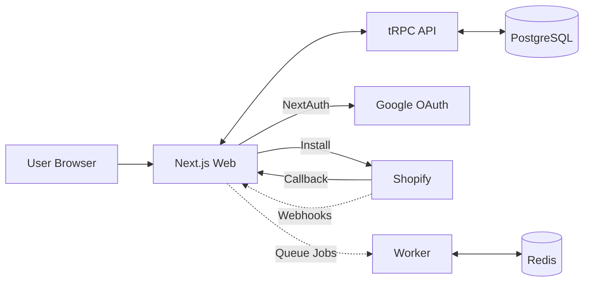
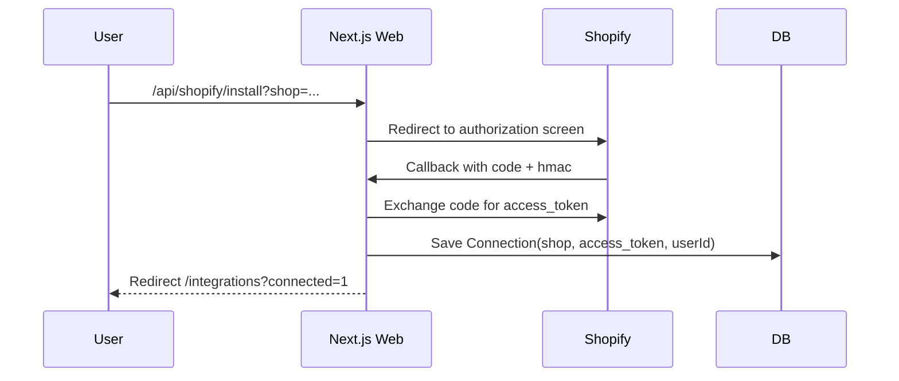

## Architecture

### High-Level Components

- Web (Next.js): UI, NextAuth, API routes (OAuth/webhooks), tRPC handler
- API (tRPC server): business logic, Shopify Admin API calls
- DB (PostgreSQL via Prisma): multi-tenant data
- Worker (BullMQ): async jobs (planned)
- External: Shopify Admin API, Webhooks, Email providers

### Component Diagram

### Shopify OAuth Sequence

### Data Access

- tRPC reads Connection for a shop to call Shopify Admin API (non-protected endpoints)
- Prisma handles multi-tenant scoping via `userId` on `Connection`

### Webhooks

- HMAC verified endpoint receives Shopify webhooks
- `PROTECTED_WEBHOOKS` gate prevents registering protected topics unless approved
- `MOCK_WEBHOOKS` can seed `Event` rows for local/dev

### Security Considerations

- Validate Shopify HMAC on callback and webhooks
- OAuth `state` cookie for CSRF protection
- Host over HTTPS with a tunnel during development

### Scaling Notes

- Move Shopify fetches to background worker for polling/sync
- Cache hot reads (orders) with Redis
- Add per-tenant rate limiting and isolation
