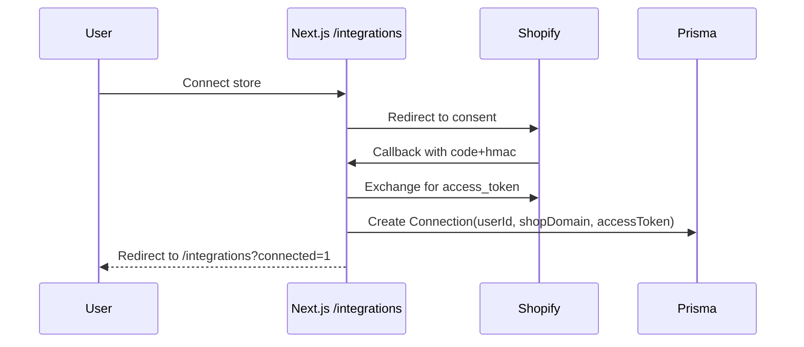

## Integrations

### Shopify

**Capabilities**

- OAuth install, token stored in `Connection`
- Non-protected Admin API reads (recent orders, single order)
- Webhook receiver with HMAC verification

**Protected topics** (require Partner approval)

- `orders/create`, `refunds/create`, `orders/fulfilled`
- Controlled by `PROTECTED_WEBHOOKS` flag

**Non-protected topics**

- `app/uninstalled`, `shop/update`, `products/create`

**Env keys**

- `SHOPIFY_API_KEY`, `SHOPIFY_API_SECRET`, `SHOPIFY_APP_URL`

**Sequence (install)**

**Admin API usage**

- tRPC resolves `Connection` by `shop` and uses `X-Shopify-Access-Token` for:
  - `ordersRecent` — `/admin/api/2024-07/orders.json?status=any&limit=...`
  - `orderGet` — `/admin/api/2024-07/orders/{id}.json`

**Security/HMAC verification**

- OAuth callback: compute `sha256` HMAC using `SHOPIFY_API_SECRET` over the sorted query string (all params except `hmac`), compare to `hmac` param.
- Webhooks: verify `X-Shopify-Hmac-Sha256` header equals the base64-encoded `sha256` HMAC of the raw request body using `SHOPIFY_API_SECRET`.

### Email (planned)

**Outbound**

- Short-term: stub only (no delivery)
- Options: Resend API, Nodemailer + SMTP

**Inbound**

- Inbound parse webhooks (Mailgun/Postmark): POST to `/api/webhooks/email`
- IMAP polling for custom domains
- Normalize into `Thread`/`Message` and correlate with `Order`

**Security**

- Webhook signing (provider-specific)
- Provider credentials in env; encrypt at rest (future)
