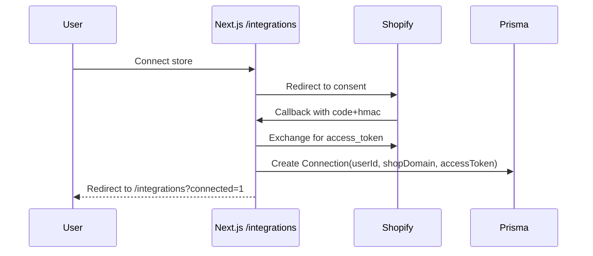

## Integrations

### Shopify

**Capabilities**

- OAuth install, token stored in `Connection`
- Non-protected Admin API reads (recent orders, single order)
- Webhook receiver with HMAC verification

**Essential webhooks** (always registered)

- `orders/create`, `orders/fulfilled`, `refunds/create`, `app/uninstalled`
- These are required for core functionality and are always registered

**Additional topics** (optional, controlled by `PROTECTED_WEBHOOKS` flag)

- `shop/update`, `products/create`
- Only registered when `PROTECTED_WEBHOOKS=true`

**Env keys**

- `SHOPIFY_API_KEY`, `SHOPIFY_API_SECRET`, `SHOPIFY_APP_URL`

**Sequence (install)**

**Admin API usage**

- tRPC resolves `Connection` by `shop` and uses `X-Shopify-Access-Token` for:
  - `ordersRecent` — `/admin/api/2024-07/orders.json?status=any&limit=...`
  - `orderGet` — `/admin/api/2024-07/orders/{id}.json`

**Security/HMAC verification**

- OAuth callback: compute `sha256` HMAC using `SHOPIFY_API_SECRET` over the sorted query string (all params except `hmac`), compare to `hmac` param.
- Webhooks: verify `X-Shopify-Hmac-Sha256` header equals the base64-encoded `sha256` HMAC of the raw request body using `SHOPIFY_API_SECRET`.

### Email (planned)

**Outbound**

- Short-term: stub only (no delivery)
- Options: Resend API, Nodemailer + SMTP

**Inbound**

- Route forwarded support mail to app-managed domain (e.g., `mail.<app-domain>`) via provider (Mailgun/Postmark)
- Webhook: `POST /api/webhooks/email/custom`
  - Verify shared secret (header `x-email-webhook-secret`) and provider signature (Mailgun-style) when configured
  - Parse envelope, headers, subject, text/html, attachments
  - Identify tenant via alias in `Connection.metadata.alias` (e.g., `in+<tenant>-<id>@mail.<app-domain>`) and persist `Thread`/`Message`
  - Correlate to `Order` with priority:
  1. **Order number from subject/body** (e.g., "Order 1003", "#1003") - highest priority
  2. **Customer email matching** - fallback only if no order number found
- This ensures emails mentioning specific orders are correctly matched
  - Create `AISuggestion` stub (worker pipeline recommended)
  - Guardrails: payload size cap (25MB), alias disable/enable enforced, rotate alias supported

**Alias management**

- Create: `/integrations` → Custom Email → Create alias
- Rotate: regenerates alias and secret; update forwarding target accordingly
- Disable/Enable: blocks/permits inbound for that alias (webhook returns 403 when disabled)

**Security**

- Webhook signing (provider-specific): Mailgun-style signature supported via `MAILGUN_SIGNING_KEY`
- `x-email-webhook-secret` header must match the per-tenant secret stored in `Connection.accessToken`
- Provider credentials in env; encrypt at rest (future)
