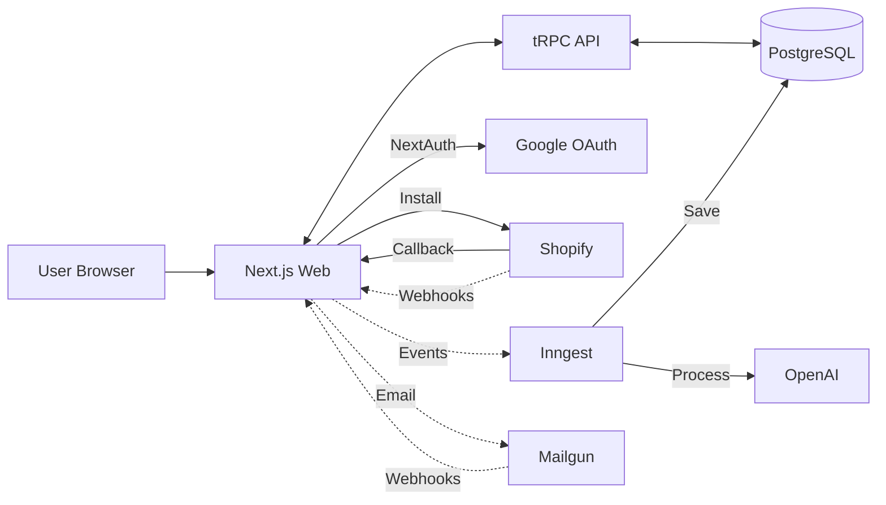
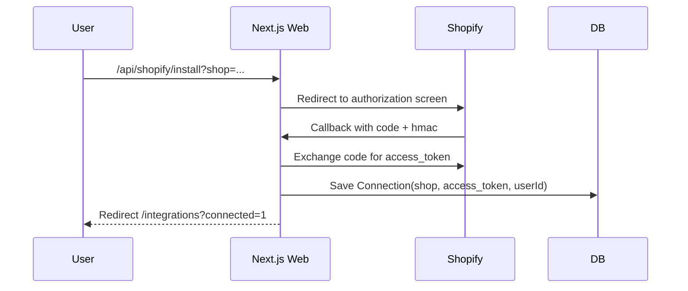

## Architecture

### High-Level Components

- Web (Next.js): UI, NextAuth, API routes (OAuth/webhooks), tRPC handler, Inngest functions
- API (tRPC server): business logic, Shopify Admin API calls
- DB (PostgreSQL via Prisma): multi-tenant data
- Background Jobs (Inngest): async email processing, AI suggestion generation (serverless, event-driven)
- External: Shopify Admin API, Webhooks, Mailgun (email), OpenAI (AI)

### Component Diagram

### Shopify OAuth Sequence

### Data Access

- tRPC reads Connection for a shop to call Shopify Admin API (non-protected endpoints)
- Prisma handles multi-tenant scoping via `userId` on `Connection`

### Webhooks

- HMAC verified endpoint receives Shopify webhooks
- `PROTECTED_WEBHOOKS` gate prevents registering protected topics unless approved
- `MOCK_WEBHOOKS` can seed `Event` rows for local/dev

### Security Considerations

- Validate Shopify HMAC on callback and webhooks
- OAuth `state` cookie for CSRF protection
- Host over HTTPS with a tunnel during development

### Background Jobs (Inngest)

- Email processing: Inbound emails trigger Inngest events
- AI suggestion generation: Async processing to avoid webhook timeouts
- Built-in retries: 3 attempts with exponential backoff
- Serverless: No Redis polling required, scales automatically

### Scaling Notes

- Inngest handles background job scaling automatically (serverless)
- Cache hot reads (orders) with Redis (optional, Upstash)
- Add per-tenant rate limiting and isolation
- Inngest functions process async work without blocking webhooks
