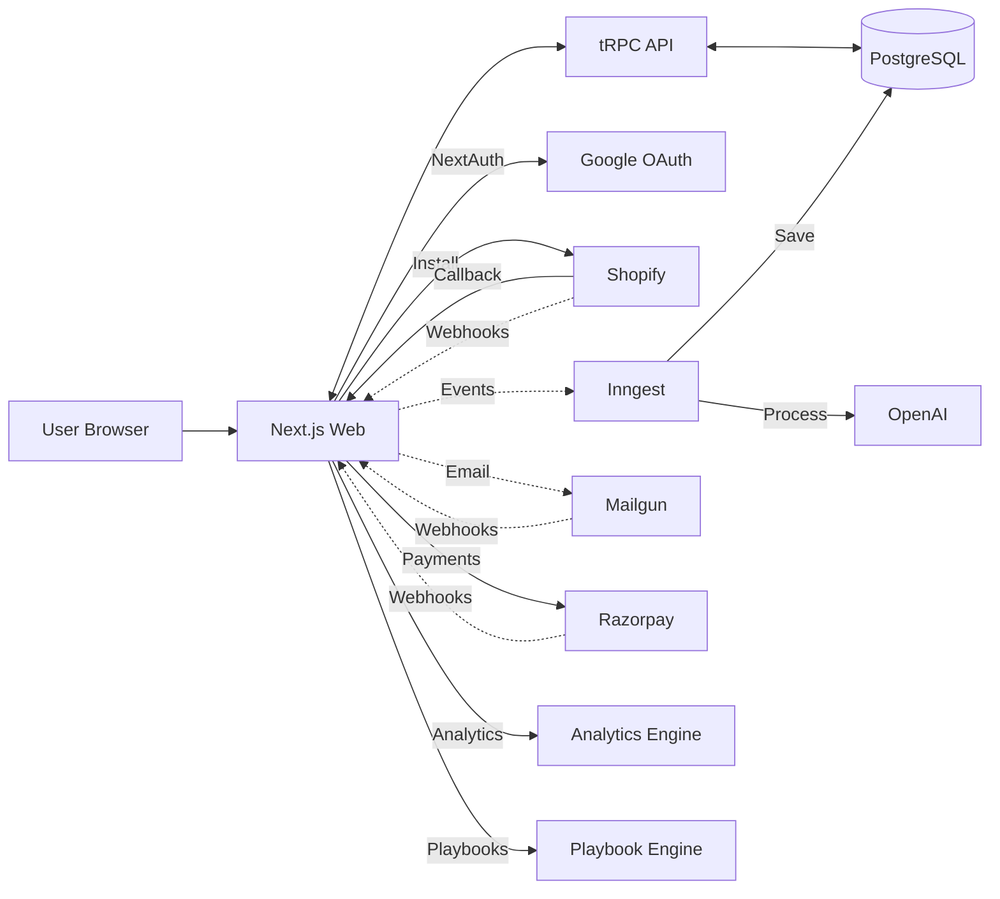
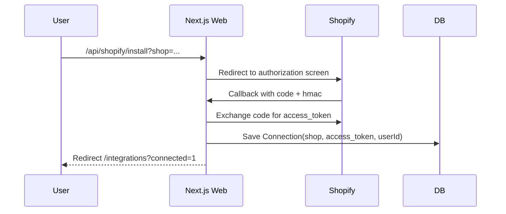

## Architecture

### High-Level Components

- Web (Next.js): UI, NextAuth, API routes (OAuth/webhooks), tRPC handler, Inngest functions
- API (tRPC server): business logic, Shopify Admin API calls, payment processing, playbook management
- DB (PostgreSQL via Prisma): multi-tenant data with subscriptions, usage tracking, and automation playbooks
- Background Jobs (Inngest): async email processing, AI suggestion generation (serverless, event-driven)
- External: Shopify Admin API, Webhooks, Mailgun (email), OpenAI (AI), Razorpay (payments)

### Component Diagram

### Shopify OAuth Sequence

### Data Access

- tRPC reads Connection for a shop to call Shopify Admin API (non-protected endpoints)
- Prisma handles multi-tenant scoping via `userId` on `Connection`

### Webhooks

- HMAC verified endpoint receives Shopify webhooks
- `PROTECTED_WEBHOOKS` gate prevents registering protected topics unless approved
- `MOCK_WEBHOOKS` can seed `Event` rows for local/dev

### Security Considerations

- Validate Shopify HMAC on callback and webhooks
- OAuth `state` cookie for CSRF protection
- Host over HTTPS with a tunnel during development

### Background Jobs (Inngest)

- Email processing: Inbound emails trigger Inngest events
- AI suggestion generation: Async processing to avoid webhook timeouts
- Built-in retries: 3 attempts with exponential backoff
- Serverless: No Redis polling required, scales automatically

### Key Features

**Subscription & Billing:**

- Razorpay integration for subscription management
- Usage tracking and enforcement (emails sent, AI suggestions)
- Plan types: STARTER, GROWTH, PRO, ENTERPRISE, TRIAL
- Automatic trial period and upgrade prompts

**Analytics Dashboards:**

- AI Support Analytics: response time, ROI, customer satisfaction, volume trends
- Shopify Business Analytics: revenue, orders, customers, AOV, growth metrics
- Real-time metrics with 7-day trend visualizations

**Automation Playbooks:**

- No-code automation builder with 6 categories
- 8 default playbooks (refund, exchange, re-engagement, etc.)
- AI-powered execution with confidence thresholds
- Manual approval workflows for high-value actions

**Email Management:**

- Per-store email aliases with environment-specific routing
- Mailgun integration with Reply-To support
- Store-specific support email configuration
- Webhook idempotency using Redis

**Multi-Tenant Security:**

- Complete data isolation by userId
- All queries scoped to user's connections
- Rate limiting: API (100/min), AI (10/min), Email (20/min)
- HMAC verification for Shopify webhooks
- Signature verification for Mailgun webhooks

### Scaling Notes

- Inngest handles background job scaling automatically (serverless)
- Cache hot reads (orders) with Redis (optional, Upstash)
- Per-tenant rate limiting and usage tracking
- Inngest functions process async work without blocking webhooks
- Subscription-based resource allocation and limits enforcement
