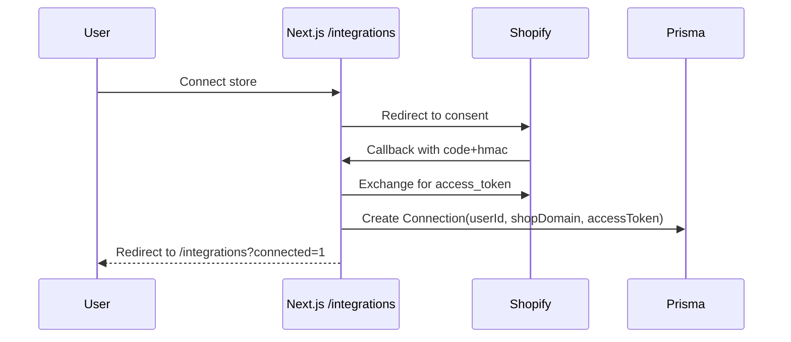
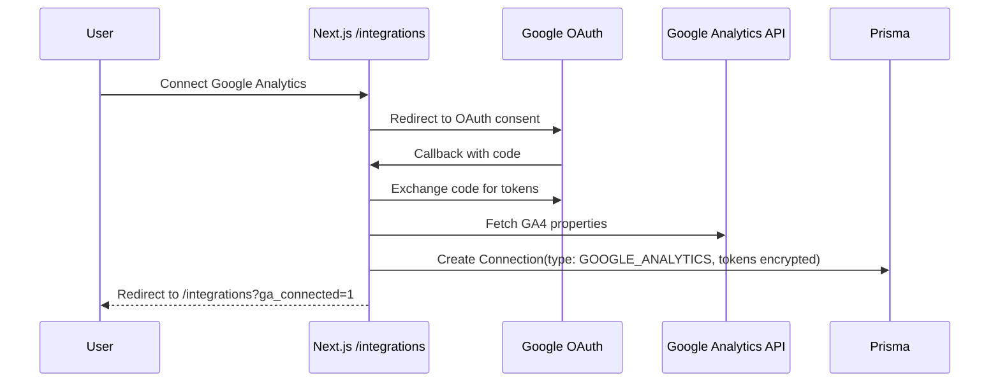
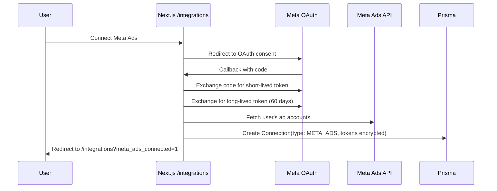

## Integrations

### Shopify

**Capabilities**

- OAuth install, token stored in `Connection`
- Non-protected Admin API reads (recent orders, single order)
- Webhook receiver with HMAC verification

**Essential webhooks** (always registered)

- `orders/create`, `orders/fulfilled`, `refunds/create`, `app/uninstalled`
- These are required for core functionality and are always registered

**Additional topics** (optional, controlled by `PROTECTED_WEBHOOKS` flag)

- `shop/update`, `products/create`
- Only registered when `PROTECTED_WEBHOOKS=true`

**Env keys**

- `SHOPIFY_API_KEY`, `SHOPIFY_API_SECRET`, `SHOPIFY_APP_URL`

**Sequence (install)**

**Admin API usage**

- tRPC resolves `Connection` by `shop` and uses `X-Shopify-Access-Token` for:
  - `ordersRecent` — `/admin/api/2024-07/orders.json?status=any&limit=...`
  - `orderGet` — `/admin/api/2024-07/orders/{id}.json`

**Security/HMAC verification**

- OAuth callback: compute `sha256` HMAC using `SHOPIFY_API_SECRET` over the sorted query string (all params except `hmac`), compare to `hmac` param.
- Webhooks: verify `X-Shopify-Hmac-Sha256` header equals the base64-encoded `sha256` HMAC of the raw request body using `SHOPIFY_API_SECRET`.

### Email (planned)

**Outbound**

- Short-term: stub only (no delivery)
- Options: Resend API, Nodemailer + SMTP

**Inbound**

- Route forwarded support mail to app-managed domain (e.g., `mail.<app-domain>`) via provider (Mailgun/Postmark)
- Webhook: `POST /api/webhooks/email/custom`
  - Verify shared secret (header `x-email-webhook-secret`) and provider signature (Mailgun-style) when configured
  - Parse envelope, headers, subject, text/html, attachments
  - Identify tenant via alias in `Connection.metadata.alias` (e.g., `in+<tenant>-<id>@mail.<app-domain>`) and persist `Thread`/`Message`
  - Correlate to `Order` with priority:
  1. **Order number from subject/body** (e.g., "Order 1003", "#1003") - highest priority
  2. **Customer email matching** - fallback only if no order number found
- This ensures emails mentioning specific orders are correctly matched
  - Create `AISuggestion` stub (worker pipeline recommended)
  - Guardrails: payload size cap (25MB), alias disable/enable enforced, rotate alias supported

**Alias management**

- Create: `/integrations` → Custom Email → Create alias
- Rotate: regenerates alias and secret; update forwarding target accordingly
- Disable/Enable: blocks/permits inbound for that alias (webhook returns 403 when disabled)

**Security**

- Webhook signing (provider-specific): Mailgun-style signature supported via `MAILGUN_SIGNING_KEY`
- `x-email-webhook-secret` header must match the per-tenant secret stored in `Connection.accessToken`
- Provider credentials in env; encrypt at rest (future)

### Google Analytics

**Capabilities**

- OAuth 2.0 integration with Google Analytics 4 (GA4)
- Fetch GA4 properties for connected accounts
- Display comprehensive analytics data:
  - Sessions, Users, Page Views, Bounce Rate
  - E-commerce metrics (Revenue, Transactions, Conversion Rate, AOV)
  - Traffic sources and top pages
  - Daily trend data
  - Session metrics (avg duration, pages per session)
- Support for multiple GA4 properties per account
- Automatic token refresh and validation

**Env keys**

- `GOOGLE_ANALYTICS_CLIENT_ID` - OAuth 2.0 Client ID from Google Cloud Console
- `GOOGLE_ANALYTICS_CLIENT_SECRET` - OAuth 2.0 Client Secret
- Redirect URI must be configured in Google Cloud Console:
  - Development: `http://localhost:3000/api/google-analytics/callback`
  - Staging: `https://staging.zyyp.ai/api/google-analytics/callback`
  - Production: `https://www.zyyp.ai/api/google-analytics/callback`

**Sequence (install)**

**OAuth Scopes**

- `https://www.googleapis.com/auth/analytics.readonly` - Read-only access to Google Analytics data

**Token Management**

- Access tokens are automatically refreshed when expired
- Refresh tokens are stored encrypted in the database
- Tokens are revoked from Google when disconnecting

**API Usage**

- Uses Google Analytics Admin API (`/v1beta/accounts`, `/v1beta/properties`) to list properties
- Uses Google Analytics Data API (`/v1beta/properties/{propertyId}:runReport`) to fetch metrics
- Handles 404 errors gracefully with fallback to global properties endpoint
- Supports multiple accounts per user

**Security**

- OAuth tokens encrypted at rest using `encryptSecure`
- Automatic token refresh prevents expired token errors
- Token revocation on disconnect removes access from Google account

### Meta Ads

**Capabilities**

- OAuth 2.0 integration with Meta Ads (Facebook Ads)
- Fetch ad accounts for connected Meta Business accounts
- Display comprehensive ad performance data:
  - Spend, Impressions, Clicks, CTR, CPC, CPM
  - Conversions and conversion value
  - ROAS (Return on Ad Spend) and CPA
  - Reach and Frequency
  - Link clicks, Post engagement, Video views
  - Campaign and ad set breakdowns
  - Daily trend data over time
- Support for multiple ad accounts per user
- Automatic long-lived token exchange and refresh
- Comprehensive error handling for token expiration, rate limits, and permissions

**Env keys**

- `META_ADS_APP_ID` - Meta App ID from Meta for Developers
- `META_ADS_APP_SECRET` - Meta App Secret
- `META_ADS_REDIRECT_URI` - OAuth redirect URI (auto-constructed if not set)
  - Development: `http://localhost:3000/api/meta-ads/callback`
  - Staging: `https://staging.zyyp.ai/api/meta-ads/callback`
  - Production: `https://www.zyyp.ai/api/meta-ads/callback`

**Sequence (install)**

**OAuth Scopes**

- `ads_read` - Read-only access to ad account data (required)
- `ads_management` - Full access to ad account management (optional, for future features)

**Token Management**

- Short-lived tokens (1-2 hours) are automatically exchanged for long-lived tokens (60 days)
- Exchange tokens are stored encrypted for automatic refresh
- Long-lived tokens are refreshed automatically before expiration
- Tokens are validated before use with fallback to refresh if invalid

**API Usage**

- Uses Meta Graph API (`/v21.0/oauth/access_token`) for token exchange
- Uses Meta Graph API (`/v21.0/{adAccountId}/insights`) for comprehensive insights
- Uses Meta Graph API (`/v21.0/{adAccountId}/campaigns`) and `/adsets` for campaign/adset data
- Supports date range filtering (7d, 30d, 90d)
- Handles rate limits with appropriate error messages
- Fetches conversion data (purchase actions and values) for ROAS calculation

**Error Handling**

- Token expiration (error code 190) → User-friendly message prompting reconnection
- Rate limit exceeded (error code 10) → Message to try again later
- Invalid permissions (error code 200) → Message to reconnect with proper permissions
- All errors logged to Sentry in production/staging

**Security**

- OAuth tokens encrypted at rest using `encryptSecure`
- Exchange tokens stored separately for refresh mechanism
- State parameter for CSRF protection in OAuth flow
- HttpOnly cookies for OAuth state storage
- Automatic token refresh prevents expired token errors
