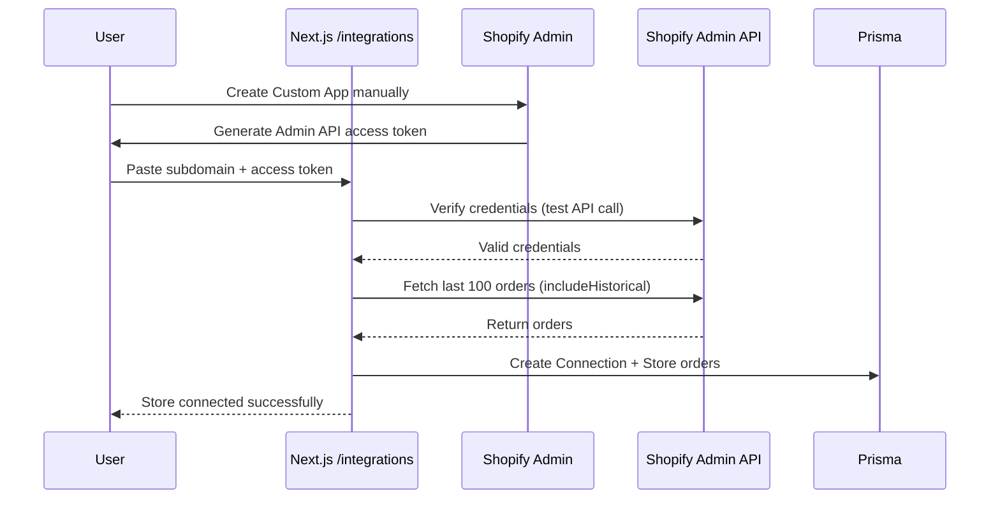

## Integrations

### Shopify

**Capabilities**

- Custom App connection with manual access token entry
- Admin API access for reading orders and store data
- Initial sync of up to 100 historical orders (up to 2 years back)
- Manual order sync via sync button
- Store limit enforcement based on subscription plan (Trial: 1, Starter: 1, Growth: 3, Pro: 10, Enterprise: unlimited)
- Webhook receiver with HMAC verification (optional - for real-time updates)

**Connection Method**

- **Custom App**: Users manually create a Custom App in Shopify Admin and copy the Admin API access token
- No OAuth flow required - works entirely on localhost without tunnels
- Connection stored in `Connection` table with encrypted access token

**Order Syncing**

- **Initial Sync**: Automatically fetches last 100 orders when store is connected (includes historical orders beyond 60 days)
- **Manual Sync**: Users can click sync button (🔄) to refresh orders anytime
- **API Calls**: All order syncing uses direct API calls to Shopify Admin API
- **Time Range**: Fetches orders up to 2 years back (Shopify's default limit is 60 days)

**Webhooks** (Optional)

- Webhooks are **optional** and only provide real-time updates
- If webhooks are configured, they register:
  - `orders/create` - Real-time order notifications
  - `orders/fulfilled` - Fulfillment updates
  - `refunds/create` - Refund notifications
  - `app/uninstalled` - App removal notifications
- Webhooks require a public URL (tunnel needed only for webhook testing)

**Env keys** (Optional - only for webhooks)

- `SHOPIFY_API_SECRET` - Only needed if using webhooks (for HMAC verification)
- `SHOPIFY_APP_URL` - Only needed if registering webhooks programmatically

**Connection Sequence**

**Admin API Usage**

- Uses `X-Shopify-Access-Token` header for all API calls
- `getOrders(limit, { includeHistorical: true })` - Fetches orders with historical data
- Orders are stored in database with `connectionId` linking to specific store
- Each order includes: `shopifyId`, `status`, `email`, `totalAmount`, `shopDomain`, `connectionId`

**Plan Limits**

- **Trial/Starter**: 1 store maximum
- **Growth**: 3 stores maximum
- **Pro**: 10 stores maximum
- **Enterprise**: Unlimited stores
- Backend enforces limits when creating connections

**Security**

- Access tokens encrypted at rest using `encryptSecure`
- Token verification before connection (test API call)
- Each store's orders are isolated by `connectionId`
- No OAuth flow means no callback URLs or redirect handling needed

**Disconnection**

- When disconnecting a store, users are reminded to also delete the Custom App from Shopify Admin
- Disconnection removes all stored data (orders, messages, threads) for that store

### Email (planned)

**Outbound**

- Short-term: stub only (no delivery)
- Options: Resend API, Nodemailer + SMTP

**Inbound**

- Route forwarded support mail to app-managed domain (e.g., `mail.<app-domain>`) via provider (Mailgun/Postmark)
- Webhook: `POST /api/webhooks/email/custom`
  - Verify shared secret (header `x-email-webhook-secret`) and provider signature (Mailgun-style) when configured
  - Parse envelope, headers, subject, text/html, attachments
  - Identify tenant via alias in `Connection.metadata.alias` (e.g., `in+<tenant>-<id>@mail.<app-domain>`) and persist `Thread`/`Message`
  - Correlate to `Order` with priority:
  1. **Order number from subject/body** (e.g., "Order 1003", "#1003") - highest priority
  2. **Customer email matching** - fallback only if no order number found
- This ensures emails mentioning specific orders are correctly matched
  - Create `AISuggestion` stub (worker pipeline recommended)
  - Guardrails: payload size cap (25MB), alias disable/enable enforced, rotate alias supported

**Alias management**

- Create: `/integrations` → Custom Email → Create alias
- Rotate: regenerates alias and secret; update forwarding target accordingly
- Disable/Enable: blocks/permits inbound for that alias (webhook returns 403 when disabled)

**Security**

- Webhook signing (provider-specific): Mailgun-style signature supported via `MAILGUN_SIGNING_KEY`
- `x-email-webhook-secret` header must match the per-tenant secret stored in `Connection.accessToken`
- Provider credentials in env; encrypt at rest (future)

### Google Analytics

**Capabilities**

- OAuth 2.0 integration with Google Analytics 4 (GA4)
- Fetch GA4 properties for connected accounts
- Display comprehensive analytics data:
  - Sessions, Users, Page Views, Bounce Rate
  - E-commerce metrics (Revenue, Transactions, Conversion Rate, AOV)
  - Traffic sources and top pages
  - Daily trend data
  - Session metrics (avg duration, pages per session)
- Support for multiple GA4 properties per account
- Automatic token refresh and validation

**Env keys**

- `GOOGLE_ANALYTICS_CLIENT_ID` - OAuth 2.0 Client ID from Google Cloud Console
- `GOOGLE_ANALYTICS_CLIENT_SECRET` - OAuth 2.0 Client Secret
- Redirect URI must be configured in Google Cloud Console:
  - Development: `http://localhost:3000/api/google-analytics/callback`
  - Staging: `https://staging.zyyp.ai/api/google-analytics/callback`
  - Production: `https://www.zyyp.ai/api/google-analytics/callback`

**Sequence (install)**

**OAuth Scopes**

- `https://www.googleapis.com/auth/analytics.readonly` - Read-only access to Google Analytics data

**Token Management**

- Access tokens are automatically refreshed when expired
- Refresh tokens are stored encrypted in the database
- Tokens are revoked from Google when disconnecting

**API Usage**

- Uses Google Analytics Admin API (`/v1beta/accounts`, `/v1beta/properties`) to list properties
- Uses Google Analytics Data API (`/v1beta/properties/{propertyId}:runReport`) to fetch metrics
- Handles 404 errors gracefully with fallback to global properties endpoint
- Supports multiple accounts per user

**Security**

- OAuth tokens encrypted at rest using `encryptSecure`
- Automatic token refresh prevents expired token errors
- Token revocation on disconnect removes access from Google account

### Meta Ads

**Capabilities**

- OAuth 2.0 integration with Meta Ads (Facebook Ads)
- Fetch ad accounts for connected Meta Business accounts
- Display comprehensive ad performance data:
  - Spend, Impressions, Clicks, CTR, CPC, CPM
  - Conversions and conversion value
  - ROAS (Return on Ad Spend) and CPA
  - Reach and Frequency
  - Link clicks, Post engagement, Video views
  - Campaign and ad set breakdowns
  - Daily trend data over time
- Support for multiple ad accounts per user
- Automatic long-lived token exchange and refresh
- Comprehensive error handling for token expiration, rate limits, and permissions

**Env keys**

- `META_ADS_APP_ID` - Meta App ID from Meta for Developers
- `META_ADS_APP_SECRET` - Meta App Secret
- `META_ADS_REDIRECT_URI` - OAuth redirect URI (auto-constructed if not set)
  - Development: `http://localhost:3000/api/meta-ads/callback`
  - Staging: `https://staging.zyyp.ai/api/meta-ads/callback`
  - Production: `https://www.zyyp.ai/api/meta-ads/callback`

**Sequence (install)**

**OAuth Scopes**

- `ads_read` - Read-only access to ad account data (required)
- `ads_management` - Full access to ad account management (optional, for future features)

**Token Management**

- Short-lived tokens (1-2 hours) are automatically exchanged for long-lived tokens (60 days)
- Exchange tokens are stored encrypted for automatic refresh
- Long-lived tokens are refreshed automatically before expiration
- Tokens are validated before use with fallback to refresh if invalid

**API Usage**

- Uses Meta Graph API (`/v21.0/oauth/access_token`) for token exchange
- Uses Meta Graph API (`/v21.0/{adAccountId}/insights`) for comprehensive insights
- Uses Meta Graph API (`/v21.0/{adAccountId}/campaigns`) and `/adsets` for campaign/adset data
- Supports date range filtering (7d, 30d, 90d)
- Handles rate limits with appropriate error messages
- Fetches conversion data (purchase actions and values) for ROAS calculation

**Error Handling**

- Token expiration (error code 190) → User-friendly message prompting reconnection
- Rate limit exceeded (error code 10) → Message to try again later
- Invalid permissions (error code 200) → Message to reconnect with proper permissions
- All errors logged to Sentry in production/staging

**Security**

- OAuth tokens encrypted at rest using `encryptSecure`
- Exchange tokens stored separately for refresh mechanism
- State parameter for CSRF protection in OAuth flow
- HttpOnly cookies for OAuth state storage
- Automatic token refresh prevents expired token errors
